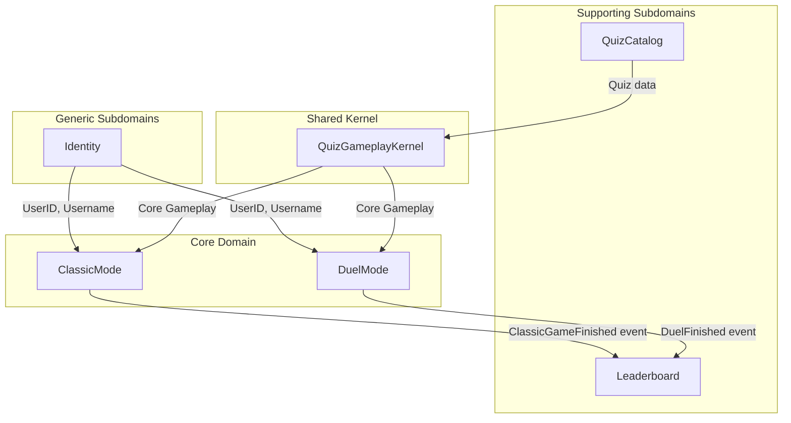

# Quiz Sprint - Domain Documentation

This directory contains the domain model documentation for the Quiz Sprint application, following Domain-Driven Design (DDD) principles. The model is described using a set of structured YAML files, which define each Bounded Context.

## Business Goals

- Provide an engaging quiz-taking experience for users.
- Foster a competitive environment through leaderboards and multiple game modes.
- Encourage speed and accuracy in answering questions.
- Integrate seamlessly with Telegram for easy access and social interaction.

## Context Map

The system is divided into several Bounded Contexts. Here is a map showing their relationships:

### Interaction Patterns:

- **Shared Kernel**: The `Quiz Gameplay Kernel` contains the core logic for a single player's quiz-taking session. It is used by both `ClassicMode` and `DuelMode` contexts to run the actual gameplay.
- **Published Language**: The `Identity` context publishes user information (`UserID`, `Username`).
- **Upstream/Downstream**: `Quiz Catalog` is upstream to the `Quiz Gameplay Kernel`.
- **Event-Driven**: The core game mode contexts publish events (`ClassicGameFinished`, `DuelFinished`) which the `Leaderboard` context subscribes to.
