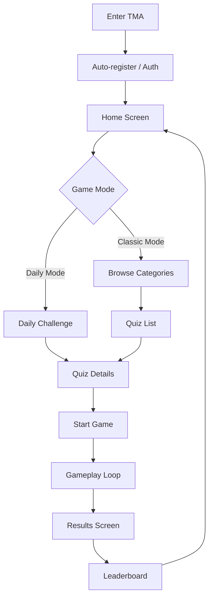

# User Journey: Main Path (Happy Path)

This document describes the main user journey in Quiz Sprint application from entry to results, detailing Classic Mode, Daily Mode, and Leaderboard mechanics.

## Journey Flow

---

## 1. Entry & Authentication

**User Action**: Opens Mini App via Telegram.

**System**:
- Auto-registers/authenticates via Telegram Init Data
- Validates cryptographic signature (prevents forgery)
- Creates or loads user profile

**UI**: Splash screen with logo → transition to home

---

## 2. Home Screen

**User sees**:
- **Game Modes Section**:
  - **Daily Mode**: Highlighted card "Daily Challenge" with countdown timer
    - Daily Streak indicator: "🔥 5 days streak" (if active)
    - "Daily Bonus x1.5" badge
    - Status: "Available" / "Completed today ✅"
  - **Classic Mode**: "Browse Quizzes" button
    - Categories grid preview (Science, History, Movies, etc.)
- **Profile Widget**: Avatar, username, stats summary

**User Choice**:
- Tap Daily Mode card → Daily Quiz details
- Tap Classic Mode / category → Quiz list

---

## 3. Quiz Selection

### 3.1 Daily Mode Path

**Characteristics**:
- Same quiz for all players today (UTC)
- Can be completed once per day
- Grants x1.5 bonus to final score
- Extends Daily Streak on completion

**UI Indicators**:
- If completed today: "✅ Completed" + disabled button
- If available: "🎁 Daily Bonus x1.5" + bright "Play" button
- Countdown: "Resets in 8h 24m"

### 3.2 Classic Mode Path

**User**:
1. Selects category
2. Sees quiz list with metadata:
   - Title, icon
   - Question count
   - Passing Score threshold
   - Personal Best (if exists): "Your best: 1500 🏆"
   - Leaderboard preview: "🥇 @champion - 2000"

**User Action**: Taps quiz card → quiz details

---

## 4. Quiz Details (Pre-Game)

**User sees**:
- Title and description
- Rules:
  - Question count (5-50)
  - Passing Score (success threshold)
  - Time per question
- **Personal Best** (if exists):
  - "Your record: 1500 points"
  - "Max streak: 7 🔥"
  - Date achieved
- **Leaderboard Preview**: Top 3 players (🥇🥈🥉)
- **Ghost Indicator** (if has Personal Best): "Beat your ghost!"

**User Action**: Taps "Start Quiz" (or "Try Again" for replay)

---

## 5. Gameplay (Classic Game)

### 5.1 Game State Display

**UI shows**:
- Progress: "Question 3/10"
- Current score: "850 points"
- Streak counter: "🔥 5 in a row"
- Multiplier: "x1.5" (if streak >= 3)
- Timer: countdown per question
- **Ghost Comparison** (if has Personal Best): "+50" (green) or "-20" (red)

### 5.2 Answer Flow

**Step 1: Question Display**
- Question text
- 2-4 answer options (buttons/cards)
- Timer starts

**Step 2: User selects answer**

**Step 3: Instant Feedback**

#### If CORRECT:
- ✅ Button turns green
- **Score Calculation**: `(BasePoints + TimeBonus) * Multiplier`
  - BasePoints: 100 (fixed)
  - TimeBonus: depends on answer speed (max → 0)
  - Multiplier: depends on Streak
- **Streak increments**: `CurrentStreak += 1`
- **Multiplier Update**:
  - Streak 0-2: x1.0 (Normal)
  - Streak 3-5: x1.5 (On Fire) → triggers 🔥 animation
  - Streak 6+: x2.0 (Godlike) → intense effects 🔥🔥
- **Visual State Change**:
  - Normal: default background
  - Heat (streak >= 3): warm colors, light fire
  - Fire (streak >= 6): intense flames, screen shake
- **Animation**: "+250 points" floats up, score counts up
- **Ghost Update**: "+50" (if ahead of Personal Best)
- **Event**: `StreakMilestoneReached` (at thresholds 3, 6)

#### If INCORRECT or TIMEOUT:
- ❌ Selected button turns red
- ✅ Correct answer highlights green (learning)
- **Streak resets**: `CurrentStreak = 0`
- **Multiplier resets**: `x1.0`
- **Visual State**: returns to Normal
- **Event**: `StreakBroken` → screen shake, fire disappears
- 0 points for question
- **Ghost**: "-30" (if behind)

**Step 4: Transition to next question** (1-2s delay for feedback absorption)

### 5.3 Visual States (Game Juice)

| Streak | Visual State | Multiplier | UI Effects |
|--------|--------------|------------|------------|
| 0-2 | Normal | x1.0 | Default background, white light |
| 3-5 | Heat | x1.5 | Orange tints, light sparks, "ON FIRE" text |
| 6+ | Fire | x2.0 | Red-yellow gradient, intense flames, "GODLIKE" text, particles |

**Milestone Transitions**:
- Reaching 3 streak: `StreakMilestoneReached` → dramatic transition to Heat
- Reaching 6 streak: `StreakMilestoneReached` → epic transition to Fire

---

## 6. Results Screen

**Trigger**: All questions answered OR time expired

**User sees**:
- **Final Score**: large, with count-up animation
- **Max Streak**: "🔥 Best streak: 7"
- **Accuracy**: "8/10 correct (80%)"
- **Passing Status**:
  - ✅ "Quiz Passed!" (if >= PassingScore)
  - ❌ "Try Again" (if < PassingScore)

### If NEW PERSONAL BEST:
- 🏆 Big animation: "NEW RECORD!"
- Comparison: "Previous: 1200 → Now: 1500 (+300)"
- Confetti/fireworks effect
- Event: `PersonalBestAchieved`

### If Daily Quiz:
- 🎁 "Daily Bonus x1.5 Applied!"
- Daily Streak update: "🔥 6 days in a row"
- Event: `DailyQuizCompleted`

**Buttons**:
- "View Leaderboard" → navigate to Leaderboard
- "Play Again" → new attempt
- "Home" → return to home screen

---

## 7. Leaderboard

**User sees**:

### Top Section (Podium):
- **🥇 1st place**: large card, gold background
- **🥈 2nd place**: medium card, silver background
- **🥉 3rd place**: bronze background

Each card shows:
- Avatar, Username
- Score
- Max Streak (additional context)

### Main List (4+):
- Scrollable list of remaining players
- Format: "#4 @username - 1200"
- **Highlight**: user's own entries (colored background)

### User Position Indicator (if not in top 50):
- Sticky footer: "Your position: #156"
- Tap → scroll to context around user (entries #146-166)

### Real-time Updates:
- WebSocket connection active
- On new scores: animated rank changes
- Notification: "🔔 5 new scores submitted"

**Scenario: User sees rank drop**
1. User at #7
2. Two new players submit higher scores
3. WebSocket: `LeaderboardUpdated` event
4. Animation: user's card slides down #7 → #8 → #9
5. Smooth transition, no sudden jump

**Actions**:
- Scroll up/down
- Tap player → profile (future)
- "Play Again" → new attempt
- "Home" → return to home screen

---

## Alternative Scenarios

### Session Interruption
If user closes TMA during gameplay:
- Session is persisted in backend
- On next entry: prompt "Continue" or "Start New Game"
- Session expires after 24 hours if not resumed

### Time Expiration
- If per-question timer expires: auto-submit as incorrect, streak resets
- If total quiz timer expires: game ends with current score
- User sees results screen with points earned

### Replay Attempt
- If quiz already completed: button changes to "Try Again"
- Quiz card shows: "Your best: 1500 🏆"
- Personal Best remains, ghost comparison active on replay
- Can submit unlimited scores to leaderboard (all entries visible)

### Daily Quiz Already Completed
- Daily Mode card shows: "✅ Completed today"
- Button disabled: "Come back tomorrow"
- Countdown: "Resets in 8h 24m"
- Daily Streak preserved if within 48h window

### Daily Streak Broken
- User missed >48 hours since last daily completion
- Next daily quiz resets streak to 1
- Event: `DailyStreakBroken`
- UI shows: "Streak reset. Start fresh today!"

### Network Disconnection During Game
- Frontend queues answer submissions
- On reconnect: sync with backend
- If sync fails: prompt "Connection lost. Retry?"
- Session preserved for recovery

### First-time User (No Personal Best)
- Quiz details show: "No record yet. Set your first score!"
- No ghost comparison during gameplay
- Results screen emphasizes: "First attempt: 1200 points!"
- Encourages replay: "Can you beat this?"

### Reaching Podium Position
- User finishes game, score enters top 3
- Results screen: special animation "🥇 You reached #2!"
- Event: `PodiumPositionAchieved`
- Notification (future): push alert for achievement

### Achieving #1 Rank
- User's score becomes top score on leaderboard
- Epic celebration: "👑 YOU'RE #1!"
- Event: `TopScoreAchieved`
- Leaderboard broadcasts to all viewers in real-time

---

## Edge Cases

### Empty Leaderboard
- Display: "No rankings yet. Be the first!"
- User's first score automatically becomes #1 🥇

### Single Player on Leaderboard
- User always #1 until another player completes
- Still shows podium medal
- Encourages sharing: "Challenge your friends!"

### Quiz Not Found / Deleted
- Graceful error: "This quiz is no longer available"
- Redirect to home screen
- Log error for investigation

### Invalid Session State
- Backend detects session tampering
- Error: "Session invalid. Please start a new game"
- Security log event

---

## Success Metrics

Track completion of key journey steps:
- Authentication success rate
- Daily Quiz participation rate
- Classic Mode quiz starts vs completions
- Personal Best improvement rate
- Leaderboard engagement (views, time spent)
- Streak retention (3+ days, 7+ days, 30+ days)