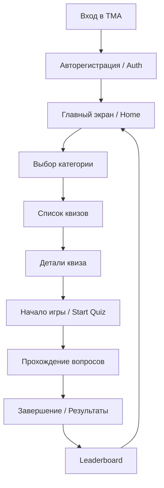

# User Journey: Основной путь (Happy Path)

Этот документ описывает основной путь пользователя в приложении Quiz Sprint от входа до получения результатов.

## Схема пути

## Шаги взаимодействия

1. **Вход и Авторизация**: Пользователь открывает Mini App. Система автоматически регистрирует его через Telegram Init Data.
2. **Главный экран**: Пользователь видит доступные категории и ежедневный челлендж.
3. **Выбор контента**: Пользователь переходит в категорию и выбирает конкретный квиз.
4. **Пре-гейм**: На экране деталей квиза пользователь видит правила, количество вопросов и свой предыдущий рекорд.
5. **Геймплей**:
    *   Пользователь отвечает на вопросы один за другим.
    *   Получает мгновенную обратную связь (правильно/неправильно).
    *   Накапливает бонусы (Streak, Time Bonus).
6. **Финал**: После последнего вопроса пользователь видит свой итоговый счет, ранг и сравнение с другими игроками.

## Альтернативные сценарии

### Прерывание сессии
Если пользователь закрывает TMA во время игры:
- Сессия сохраняется.
- При следующем входе предлагается выбор: "Продолжить" или "Начать заново".

### Истечение времени
- Если время на вопрос или весь квиз истекает, сессия завершается автоматически с текущим результатом.

### Повторное прохождение
- Если квиз уже пройден, кнопка "Start" меняется на "Try Again", а на карточке отображается лучший результат.